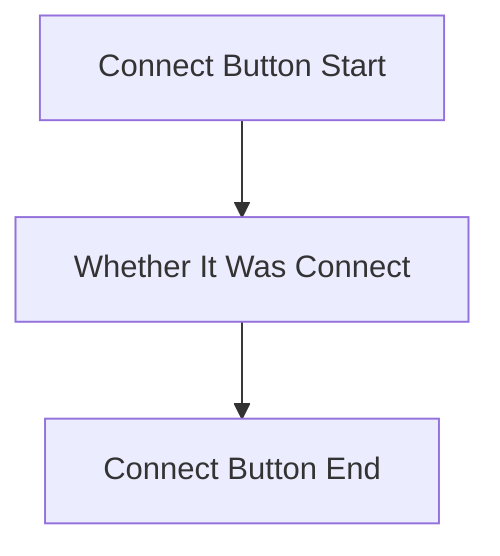
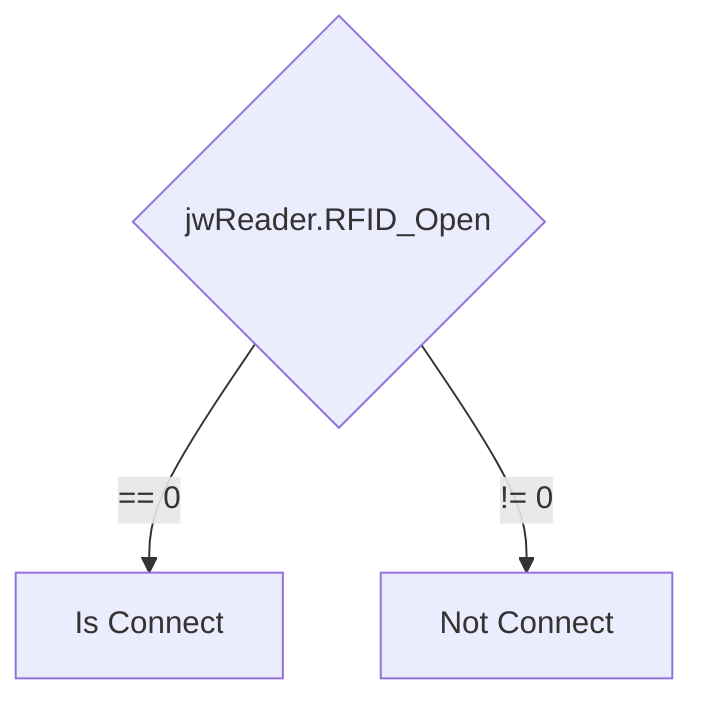
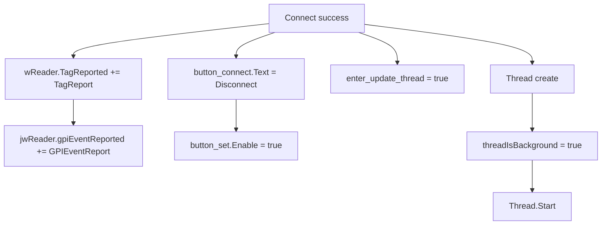
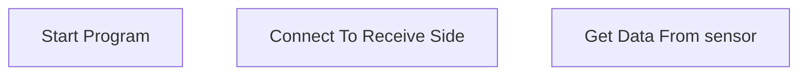

<!-- use mermaid to draw flow chart-->
<!-- TB = Top To Button
     TD = Top to Down/same as top to bottom
     BT = Button To Top
     LR = Left to Right
     RL = Right to Left
-->
[mermaid](https://mermaid-js.github.io/mermaid/#/./flowchart?id=flowcharts-basic-syntax)



DataColumn include("No.", "Tag_ID", "Last_Time")






```mermaid
flowchart TB
```


